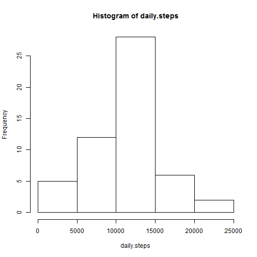
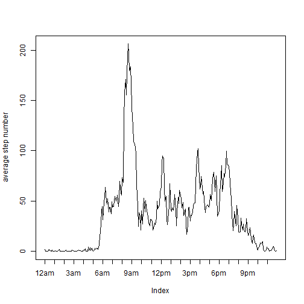
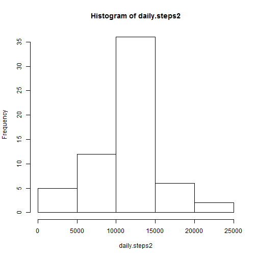
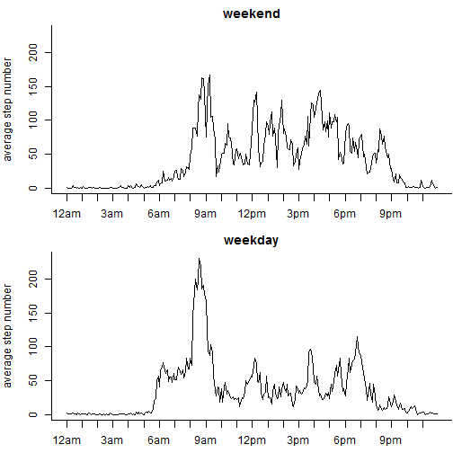

## Loading and preprocessing the data
Assuming that the data is downloaded and is in a .csv file zipped into "activity.zip"

```r
activ <- read.csv(unz("activity.zip",filename="activity.csv"))
str(activ)
```

```
## 'data.frame':	17568 obs. of  3 variables:
##  $ steps   : int  NA NA NA NA NA NA NA NA NA NA ...
##  $ date    : Factor w/ 61 levels "2012-10-01","2012-10-02",..: 1 1 1 1 1 1 1 1 1 1 ...
##  $ interval: int  0 5 10 15 20 25 30 35 40 45 ...
```

The variable **date** should be of Date class because of the comparison of weekdays and weekends (see below). The format of the dates in the dataset is following the default pattern of year(4 chars)-month(2 chars)-day(2 chars)

```r
activ$date <- as.Date(activ$date)
str(activ)
```

```
## 'data.frame':	17568 obs. of  3 variables:
##  $ steps   : int  NA NA NA NA NA NA NA NA NA NA ...
##  $ date    : Date, format: "2012-10-01" "2012-10-01" ...
##  $ interval: int  0 5 10 15 20 25 30 35 40 45 ...
```


## What is mean total number of steps taken per day?

First, observations with NA steps were removed

```r
activ2 <- activ[!is.na(activ$steps),]
```

The total number of steps can be calculated for each day using `sapply`:

```r
daily.steps <- sapply(split(activ2$steps,activ2$date), sum)
```
The histogram for the daily total steps:

```r
hist(daily.steps)
```

 

The mean and median of the total steps per day:

```r
mean(daily.steps)
```

```
## [1] 10766.19
```

```r
median(daily.steps)
```

```
## [1] 10765
```

## What is the average daily activity pattern?
Calculating the number of steps taken, averaged across all days. Then it is plotted vs the index which is actually the time interval. However, the x-axis is manipulated with `axis` to be more straightforward.

```r
interval.steps <- sapply(split(activ2$steps,activ2$interval), mean)
plot(interval.steps,type="l",xaxt="n",ylab="average step number")
timelabels <- c(paste0(c(12,1:11),"am"),paste0(c(12,1:11),"pm")) 
axis(side=1,at=0:23*12+1,labels=timelabels)
```

 
  
#### Which 5-minute interval, on average across all the days in the dataset, contains the maximum number of steps?

```r
interval.steps[interval.steps==max(interval.steps)]
```

```
##      835 
## 206.1698
```
The maximum average is in the interval of **8:35am - 8:40am**.
  
## Imputing missing values

#### Calculate the total number of missing values
Considering the original **activ** dataset with NAs, the number of missing values:

```r
sum(is.na(activ$steps))
```

```
## [1] 2304
```

There are 8 entire days with NAs (288 five minutes interval can be found a day), and no more NA occurs in the other observed days:

```r
table(activ[is.na(activ$steps),2])
```

```
## 
## 2012-10-01 2012-10-08 2012-11-01 2012-11-04 2012-11-09 2012-11-10 
##        288        288        288        288        288        288 
## 2012-11-14 2012-11-30 
##        288        288
```
Therefore, one of the mentioned concepts, i.e. usage "the mean/median for that day", is not appropriate. Consequently, the other option, i.e. "mean for that 5-minute interval", is used. Moreover, the values are rounded, because the steps are counts.
  
#### Creation of a new dataset that is equal to the original dataset but with the missing data filled in
The means of 5 minutes intervals are stored in the variable **interval.steps**.

```r
activ$steps[is.na(activ$steps)] <- round(interval.steps)
```
Note, this replaces NAs with the **interval.steps** for each of the eight days (say, NA-days), because the length of the NAs is a multiple of replacement length.

The total number of steps can be calculated as above:

```r
daily.steps2 <- sapply(split(activ$steps,activ$date), sum)
```
The histogram for the total daily steps:

```r
hist(daily.steps2)
```

 

The mean and median of the total steps per day:

```r
mean(daily.steps2)
```

```
## [1] 10765.64
```

```r
median(daily.steps2)
```

```
## [1] 10762
```
Comparing these values to the mean and median before imputing:

```r
mean(daily.steps2) - mean(daily.steps)
```

```
## [1] -0.549335
```

```r
median(daily.steps2) - median(daily.steps)
```

```
## [1] -3
```
These values are similar, that means very slight effect on the estimates, because average activity patterns were filled for the eight days without proper data. The difference between the means is caused by the rounding.
  
## Are there differences in activity patterns between weekdays and weekends?
Creating a new factor variable in the dataset with two levels – “weekday” and “weekend” indicating whether a given date is a weekday or weekend day

```r
Sys.setlocale("LC_TIME", "English")
```

```
## [1] "English_United States.1252"
```

```r
activ$weekday <- as.factor(ifelse(weekdays(activ$date,T) %in% c("Sat","Sun"),"weekend","weekday"))
```

Calculating the average number of steps taken, averaged across all weekday days or weekend days

```r
weekdaysteps <- sapply(with(activ[activ$weekday == "weekday",],split(steps,interval)), mean)
weekendsteps <- sapply(with(activ[activ$weekday == "weekend",],split(steps,interval)), mean)
```

Plotting the panel plot

```r
par(mfrow=c(2,1),bty="l",mar=c(2.5,4,2,.1))
Max <- max(c(weekendsteps,weekdaysteps))
plot(weekendsteps,type="l",xaxt="n",xlab="",ylim=c(0,Max),ylab="average step number", main="weekend")
axis(side=1,at=0:23*12+1,labels=timelabels)
plot(weekdaysteps,type="l",xaxt="n",xlab="",ylim=c(0,Max),ylab="average step number", main="weekday")
axis(side=1,at=0:23*12+1,labels=timelabels)
```

 
